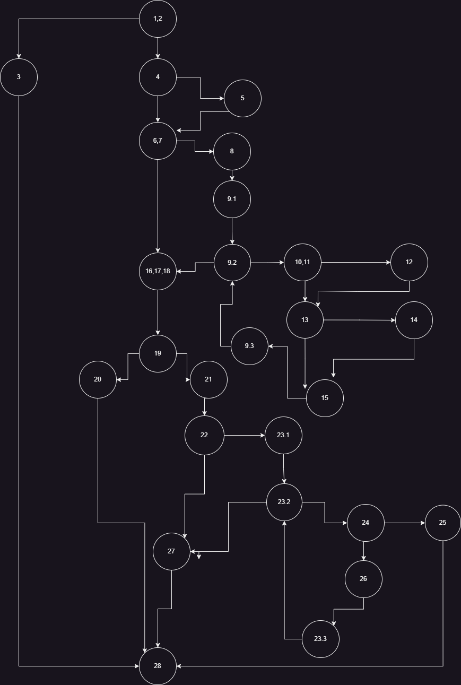
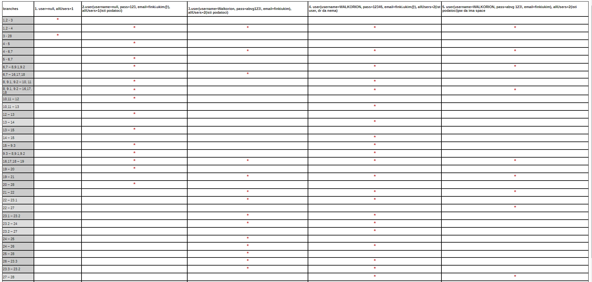

# Stefan Tosev, 213091

## 2. Control Flow Graph за функцијата

## 3. Цикломатската комплексност на графот изнесува 11.
### 1) Според региони -> графот има 11 вкупно региони
### 2) Според предикатни јазли  P+1 -> P=10(графот има 10 предикатни јазли), P+1-> 10+1=11

## 4. Тест случаи според Every branch критериумот
### Со овие пет теста исполнет е критеруимот Every branch :
### 1) user=null, allUsers=1
### 2) user(username=null, pass=123, email=finki.ukim@), allUsers=1(исти податоци за user)
### 3) user(username=Walkorion, pass=abvg123!, email=finkiukim), allUsers=2(исти податоци за user)
### 4) user(username=WALKORION, pass=12345age, email=finki.ukim@), allUsers=2(username=WALKORION, pass=2456f, email=finki.ukim15@; username=WALKORION, pass=5556, email=finki.ukim3@) (ист user да има)
### 5) user(username=WALKORION, pass=abvg 123!, email=finkiukim), allUsers=2(username=WALKORION, pass=abvg 123!, email=finkiukim; username=WALKORION, pass=abvg 123!, email=finkiukim) (password да има space)

## 5. Тест случаи според multiple condition критериумот
### if (user==null || user.getPassword()==null || user.getEmail()==null)
### Можни услови:
###  T || X || X  -> user == null, user.getPassword() == anything,  user.getEmail() == anything
###  F || T || X  -> user != null, user.getPassword() == null, user.getEmail() == anything
###  F || F || T  -> user != null, user.getPassword() != null, user.getEmail() == null
###  F || F || F  -> user != null, user.getPassword() != null, user.getEmail() != null